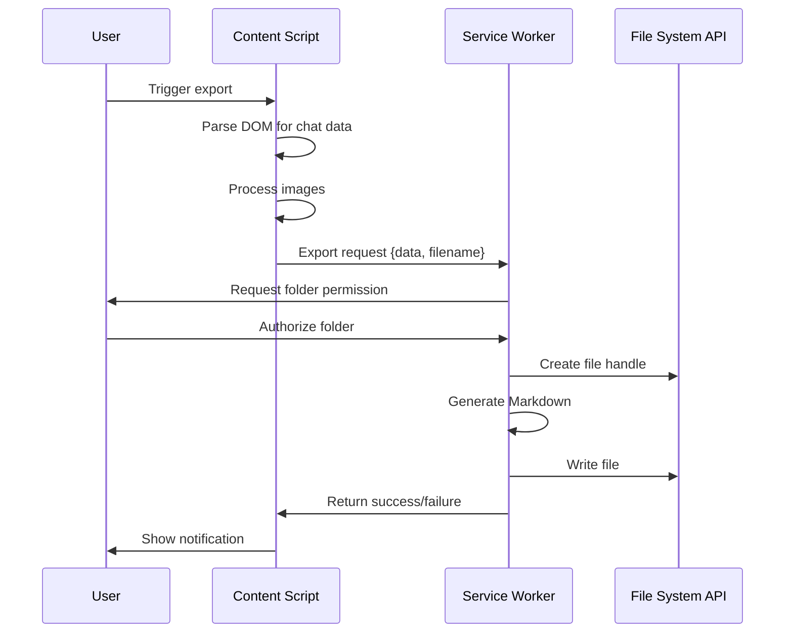

# AI Chat Exporter - Design Document

**Date**: 2026-02-19
**Version**: 0.1.0
**Status**: Approved

## Overview

AI Chat Exporter is a Chrome extension that exports AI chat conversations (ChatGPT, Gemini, Kimi, etc.) to Markdown files and syncs them directly to a user-specified Obsidian vault folder.

## Goals

- Extract chat content from AI platforms with high fidelity
- Generate well-structured Markdown with metadata
- Sync directly to local Obsidian folders using File System Access API
- Support multiple trigger methods for flexibility
- Provide extensible architecture for adding new platforms

## Architecture

### Project Structure

```
ai-chat-exporter/
├── manifest.json          # Chrome extension configuration
├── package.json
├── vite.config.js
├── background.js          # Service Worker (file operations)
├── popup/                 # Browser action popup
│   ├── popup.html
│   ├── popup.js
│   └── popup.css
├── content/               # Content scripts
│   ├── base-adapter.js    # Base adapter class
│   ├── chatgpt-adapter.js # ChatGPT adapter
│   ├── content.js         # Main entry point
│   └── content.css
├── shared/                # Shared utilities
│   ├── constants.js       # Configuration constants
│   └── utils.js           # Helper functions
├── options/               # Options page
│   ├── options.html
│   ├── options.js
│   └── options.css
├── icons/                 # Extension icons
└── docs/
    └── plans/
```

### Core Components

#### 1. Content Script
- Runs on ChatGPT pages
- Parses DOM to extract chat content
- Injects floating action button (FAB)
- Listens for keyboard shortcuts and context menu

#### 2. Background Service Worker
- Manages file writing via File System Access API
- Maintains state and settings
- Handles image downloads
- Processes export requests from content scripts

#### 3. Popup
- Quick export trigger
- Recent export history
- Quick settings access

#### 4. Options Page
- Obsidian folder selection
- File naming configuration
- Adapter toggle settings
- Export history and logs

## Data Flow



## Data Model

### Chat Message Structure

```javascript
{
  platform: "chatgpt",
  url: "https://chatgpt.com/c/...",
  title: "Discussion about Python decorators",
  messages: [
    {
      role: "user",           // user | assistant | system
      content: "...",         // HTML content
      timestamp: "2026-02-19T10:30:00Z",
      images: ["url1", ...]   // Image URLs
    }
  ],
  metadata: {
    exportedAt: "2026-02-19T10:30:00Z",
    model: "GPT-4",
    totalMessages: 15
  }
}
```

### Markdown Output Format

```markdown
---
title: Discussion about Python decorators
platform: ChatGPT
url: https://chatgpt.com/c/...
exportedAt: 2026-02-19T10:30:00Z
model: GPT-4
totalMessages: 15
tags: [ai-chat, python]
---

# Discussion about Python decorators

**Time**: 2026-02-19 10:25:00 | **Role**: user

How do Python decorators work?

---

**Time**: 2026-02-19 10:25:10 | **Role**: assistant

Python decorators are...

```python
def decorator(func):
    def wrapper():
        print("Before")
        func()
        print("After")
    return wrapper
```
```

## Trigger Methods

| Method | Implementation | API |
|--------|---------------|-----|
| Browser Icon | Popup | `chrome.action.onClicked` |
| Floating Button | Content Script | DOM injection |
| Keyboard Shortcut | Content Script + Manifest | `chrome.commands` |
| Context Menu | Background | `chrome.contextMenus` |

### Floating Action Button (FAB)

**Behavior**:
- Default: Hidden (opacity: 0)
- Mouse proximity (< 100px): Fade in (opacity: 1)
- Idle for 5 seconds: Auto-hide
- Draggable: User can drag to any position
- Position persistence: Saved to chrome.storage

**Position Memory**:
```javascript
// chrome.storage.local
{
  fabPosition: { x: 20, y: 20 }
}
```

## Settings

| Setting | Type | Default | Description |
|---------|------|---------|-------------|
| Obsidian Folder | File Picker | Required | Target folder for exports |
| Subfolder | Text | `AI Chats/{platform}/` | Relative path for exports |
| Filename Template | Select | `{platform}-{title}-{date}` | File naming pattern |
| YAML Frontmatter | Toggle | On | Include metadata header |
| Timestamps | Toggle | On | Show message timestamps |
| Download Images | Toggle | On | Download images to local |
| Image Location Mode | Radio | Relative | Relative \| Independent folder |
| Image Folder | File Picker | Optional | For independent folder mode |
| Image Relative Path | Text | `assets/` | For relative mode |
| Enable FAB | Toggle | On | Show floating button |

## Image Processing

**Flow**:
1. Extract all image URLs from chat
2. Determine save location (relative or independent folder)
3. Download images in parallel (retry 3x on failure)
4. Generate unique filenames: `{timestamp}_{random}.png`
5. Update Markdown with local paths
6. Failed downloads: Keep original URL with comment

**Path Update**:
```markdown
# Original


# Converted (relative mode)


# Converted (independent mode)

```

## Error Handling

| Scenario | Handling |
|----------|----------|
| Folder permission revoked | Re-request permission |
| Folder doesn't exist | Prompt to select new folder |
| Insufficient disk space | Show error notification |
| Image download failed | Keep original URL, log failure |
| Network interruption | Cache data, prompt retry |
| DOM structure changed | Version detection, notify user |
| Filename conflict | Auto-append timestamp suffix |
| Empty content | Disable export, show message |
| User cancels | Cleanup and release resources |

**Notification Levels**:
- SUCCESS: "Export successful! Saved to xxx.md"
- WARNING: "Some images failed to download"
- ERROR: "Export failed: Permission denied"
- INFO: "Exporting, please wait..."

## Platform Support

### Phase 1: ChatGPT
- `chatgpt.com`
- `chat.openai.com`

### Future Platforms
- Google Gemini
- Moonshot Kimi
- Anthropic Claude
- Microsoft Copilot

**Adapter Pattern**:
```javascript
class BaseAdapter {
  extractChatData() { /* abstract */ }
  getTitle() { /* abstract */ }
  getMessages() { /* abstract */ }
}

class ChatGPTAdapter extends BaseAdapter {
  // ChatGPT-specific implementation
}
```

## Testing Strategy

### Test Levels

| Type | Coverage | Tool |
|------|----------|------|
| Unit Tests | Utils, Markdown gen | Vitest |
| Integration Tests | Content-Background comms | Chrome Ext Test |
| Manual Tests | Real environment | - |

### Manual Test Checklist

- [ ] First-time setup flow
- [ ] Select Obsidian folder
- [ ] Export via browser icon
- [ ] Export via FAB
- [ ] Export via keyboard shortcut
- [ ] Export via context menu
- [ ] Export conversation with code
- [ ] Export conversation with images
- [ ] Drag FAB to new position
- [ ] Change settings and export
- [ ] Re-authorize after permission revoke
- [ ] Open exported file in Obsidian

## Implementation Phases

### Phase 1: Core MVP
1. Basic project setup
2. ChatGPT adapter
3. Markdown generation
4. File System Access API integration
5. Browser icon popup export

### Phase 2: Enhanced UX
1. Floating action button with drag
2. Keyboard shortcut
3. Context menu
4. Options page
5. Settings persistence

### Phase 3: Image Support
1. Image extraction
2. Image download
3. Path conversion
4. Retry logic

### Phase 4: Polish
1. Error handling
2. Notifications
3. Export history
4. First-time setup flow
5. Testing and bug fixes

## Dependencies

- Chrome Manifest V3
- File System Access API
- Vite + @crxjs/vite-plugin
- Vitest (testing)

## Security Considerations

- Only request necessary permissions
- Validate all file paths
- Sanitize HTML content before export
- Handle user input safely
- No external API calls (local-only)
